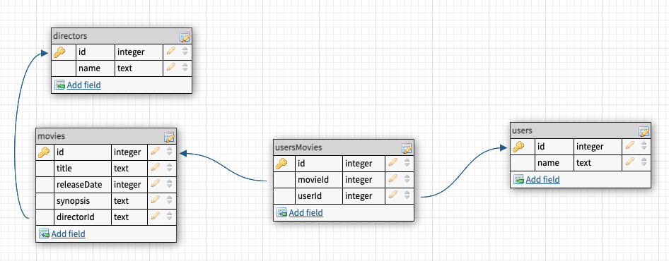

## SQL PRACTICE!!!!

### TO SET UP:

- Create a database (maybe `movies_dev` would be a good name)
- Run `psql -d [name of your database] -f schema.sql` from within this directory
- Run `psql -d [name of your database] -f seed.sql` from within this directory

### ABOUT THIS DATABASE:

Here's what the database looks like:

`usersMovies` is a join table that represents which users would claim which movies as favorites. Each user can have many favorite movies, and each movie can be favorited by many users.

### PART 1: Creating linked data
1. Think of your favorite movie that isn't directed by someone on the list of directors. Add that movie to the movies table.
1. Add the director of your new movie to the directors table.
1. Update your new movie to have the correct director.

1. Add yourself to the users table.
1. Add a row to the usersMovies table so that your user has the new movie as a favorite.
UPDATE movies
SET directorid = 19
FROM directors
WHERE movies.directorid = directors.id;

### PART 2: Querying linked data with JOINS!!!

1. Select all the movies directed by Alex Garland.
movies_dev=# SELECT * from movies;
movies_dev=# SELECT movies.title FROM directors JOIN movies ON directors.id = movies.directorId
movies_dev-# WHERE directors.name = 'Alex Garland';

2. Find the director who directed "There Will Be Blood".

SELECT directors.name FROM movies JOIN directors ON director.id = movies.directorId WHERE movies.title = 'There Will Be Blood';

3. Find all of Ryan's favorites.
4. Find everyone who added "The Lobster" as a favorite movie.
5. Find the names of all users who favorited a movie directed by Joel Cohen. Note that you may get duplicates for the reasons described here: https://stackoverflow.com/questions/23786401/why-do-multiple-table-joins-produce-duplicate-rows. You can remove duplicates like this: https://www.w3schools.com/sql/sql_distinct.asp.

### PART 3: Advanced Queries!

These are gonna be hard. Make sure to use your friend google as a resource.

1. List the movies with the number of favorites they have.
2. List the names of directors along with the number of favorites that exist for all of the movies they've made, ordered by number of favorites descending.
3. List the user name, director name and favorite count of all of the user/director combinations (based on the users_movies table).
4. Find the favorite director -- the director whose movies have the most favorites.
